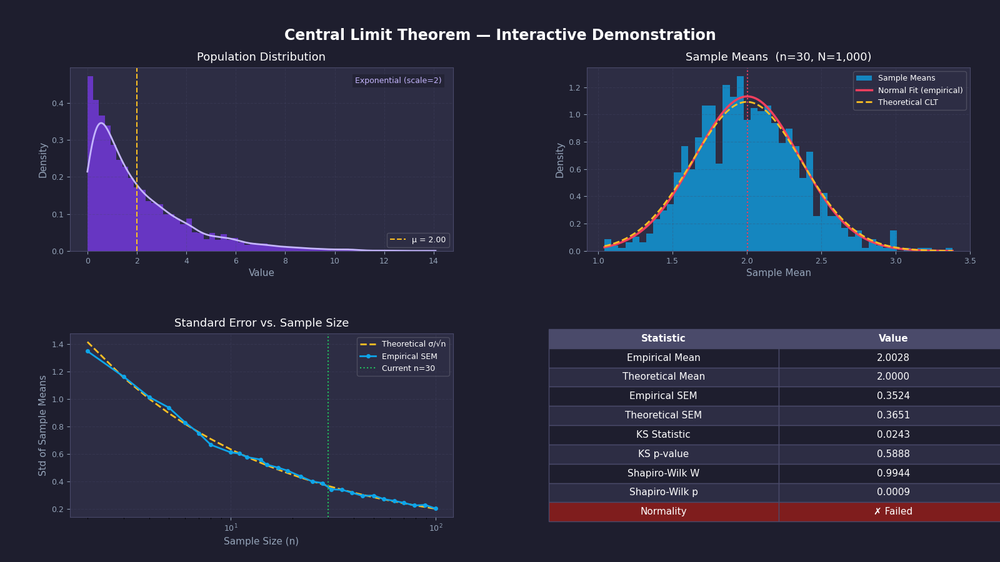

# Central Limit Theorem — Interactive Demonstration

A Python visualization toolkit that demonstrates the **Central Limit Theorem (CLT)** across five probability distributions. The tool produces a four-panel dashboard, prints a statistical summary to the console, and optionally renders a convergence animation.

---

## What is the Central Limit Theorem?

The CLT states that, given a sufficiently large sample size $n$, the distribution of sample means $\bar{X}$ converges to a **normal distribution** regardless of the shape of the original population:

$$\bar{X} \xrightarrow{d} \mathcal{N}\!\left(\mu,\, \frac{\sigma^2}{n}\right) \quad \text{as } n \to \infty$$

Key implications:

| Property | Formula |
|---|---|
| Mean of sample means | $\mathbb{E}[\bar{X}] = \mu$ |
| Std of sample means (SEM) | $\sigma_{\bar{X}} = \sigma / \sqrt{n}$ |
| Rate of convergence | $O(1/\sqrt{n})$ |

---

## Features

- **5 distributions** — Exponential, Uniform, Poisson, Gamma, Log-Normal
- **4-panel dark-theme dashboard**
  - Population distribution with KDE overlay
  - Sample means histogram vs. empirical and theoretical normal fits
  - SEM convergence curve ($\sigma/\sqrt{n}$) on a log scale
  - Statistics table with normality test results
- **Convergence animation** — watch sample means converge to normal in real time
- **Statistical tests** — Kolmogorov–Smirnov and Shapiro–Wilk with pass/fail verdict
- **Console report** printed automatically on every run
- **CLI** with full argument control; Python API also available
- **Reproducible** via `--seed`; saveable via `--save` / `--save-animation`

---

## Supported Distributions

| Key | Distribution | Mean $\mu$ | Std $\sigma$ |
|---|---|---|---|
| `exponential` | Exponential (scale=2) | 2 | 2 |
| `uniform` | Uniform (0, 10) | 5 | $10 / (2\sqrt{3})$ |
| `poisson` | Poisson ($\lambda$=5) | 5 | $\sqrt{5}$ |
| `gamma` | Gamma (k=2, $\theta$=2) | 4 | $2\sqrt{2}$ |
| `lognormal` | Log-Normal ($\mu$=0, $\sigma$=1) | $e^{0.5}$ | $\sqrt{(e-1)e}$ |

---

## Installation

```bash
pip install -r requirements.txt
```

**requirements.txt** requires Python 3.9+ and:

```
numpy>=1.21
matplotlib>=3.4
scipy>=1.7
```

---

## Usage

### CLI

```bash
# Default: Exponential, 1000 samples, sample size 30
python plot_sample_means.py

# Uniform distribution, 2000 samples, sample size 50
python plot_sample_means.py --distribution uniform --n-samples 2000 --sample-size 50

# Poisson with a fixed seed and save the figure
python plot_sample_means.py -d poisson -n 100 -N 5000 --seed 42 --save output.png

# Convergence animation
python plot_sample_means.py --animate --distribution gamma

# Save animation to GIF
python plot_sample_means.py --animate -d lognormal --save-animation clt.gif

# List available distributions
python plot_sample_means.py --list-distributions
```

#### All flags

| Flag | Short | Default | Description |
|---|---|---|---|
| `--distribution` | `-d` | `exponential` | Population distribution |
| `--n-samples` | `-N` | `1000` | Number of sample means to draw |
| `--sample-size` | `-n` | `30` | Observations per sample |
| `--seed` | `-s` | `None` | Random seed for reproducibility |
| `--save` | | `None` | Save figure to path (PNG/PDF/SVG) |
| `--animate` | | off | Show convergence animation |
| `--save-animation` | | `None` | Save animation to path (GIF/MP4) |
| `--list-distributions` | | off | Print available distributions |

### Python API

```python
from plot_sample_means import plot_clt, animate_convergence, DISTRIBUTIONS

# Static dashboard
plot_clt(
    dist=DISTRIBUTIONS["uniform"],
    n_samples=2000,
    sample_size=50,
    seed=42,
    save_path="output.png",
)

# Convergence animation
animate_convergence(
    dist=DISTRIBUTIONS["gamma"],
    sample_size=30,
    max_samples=1000,
    seed=0,
)
```

---

## Console Output

Every run prints a report to stdout:

```
──────────────────────────────────────────────
  Central Limit Theorem — Exponential (scale=2)
  N=1,000 samples  ·  n=30 per sample
──────────────────────────────────────────────
  Empirical mean         2.0031
  Theoretical mean       2.0000
  Empirical SEM          0.3621
  Theoretical SEM (σ/√n) 0.3651
──────────────────────────────────────────────
  KS statistic           0.0183  (p=0.9147)
  Shapiro-Wilk W         0.9989  (p=0.6832)
  Normality              PASSED ✓
──────────────────────────────────────────────
```

---

## Sample Visualization



---

## Project Structure

```
Central-Limit-Theorem/
├── plot_sample_means.py   # Main script (CLI + Python API)
├── requirements.txt
├── sample.png             # Example output
└── README.md
```

---

## Mathematical Background

### Exponential Distribution

$$f(x;\,\theta) = \frac{1}{\theta}\,e^{-x/\theta}, \quad x \ge 0, \quad \mu = \sigma = \theta$$

### Uniform Distribution

$$f(x;\,a,b) = \frac{1}{b-a}, \quad \mu = \frac{a+b}{2}, \quad \sigma = \frac{b-a}{2\sqrt{3}}$$

### Poisson Distribution

$$P(X=k;\,\lambda) = \frac{\lambda^k e^{-\lambda}}{k!}, \quad \mu = \sigma^2 = \lambda$$

### Gamma Distribution

$$f(x;\,k,\theta) = \frac{x^{k-1}e^{-x/\theta}}{\theta^k\Gamma(k)}, \quad \mu = k\theta, \quad \sigma = \sqrt{k}\,\theta$$

### Log-Normal Distribution

$$f(x;\,\mu,\sigma) = \frac{1}{x\sigma\sqrt{2\pi}}\exp\!\left(-\frac{(\ln x - \mu)^2}{2\sigma^2}\right)$$

$$\mathbb{E}[X] = e^{\mu + \sigma^2/2}, \quad \operatorname{Var}(X) = (e^{\sigma^2}-1)\,e^{2\mu+\sigma^2}$$
