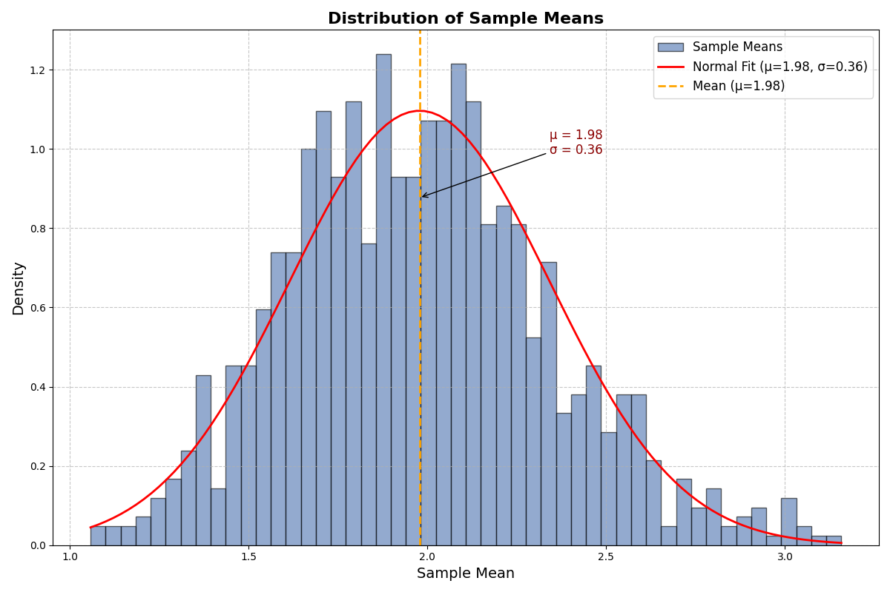

# 📊 **Central Limit Theorem (CLT) Demonstration**

This demonstration visually explains the **Central Limit Theorem (CLT)** using simulations from an **Exponential Distribution**. The CLT is a fundamental statistical principle stating that, given a sufficiently large sample size, the distribution of sample means will approximate a **normal distribution** regardless of the original distribution's shape.

The project provides a step-by-step exploration of how the CLT works in practice by:
- **Sampling** from an exponential distribution
- **Calculating** sample means
- **Plotting** the resulting distribution of means


## **Central Limit Theorem Summary**

The CLT states that, for a large enough sample size $$\(n\)$$, the sampling distribution of the sample mean will tend to be normally distributed:

- As the sample size increases, the sample means follow a normal distribution, even if the original data distribution is non-normal.
- The mean of the sample means will equal the population mean.
- The standard deviation of the sample means will shrink by a factor of $$\(\frac{\sigma}{\sqrt{n}}\)$$, where $$\(\sigma\)$$ is the population standard deviation.


## 📐 **Exponential Distribution**

The exponential distribution is often used to model the time between independent events that occur at a constant rate.

- **Probability Density Function (PDF):**

  $$f(x; \theta) = \frac{1}{\theta} e^{-\frac{x}{\theta}} \quad \text{for} \quad x \geq 0$$

- **Mean:**  
  $$\mu = \theta$$

- **Standard Deviation:**  
  $$\sigma = \theta$$


## **Features of the Demonstration**

- 🎲 **Generates Random Samples**: Creates random samples from the exponential distribution with a specified rate.
- 📈 **Visualizes Sample Means**: Plots the distribution of the means of these samples, which converge towards a normal distribution.
- 🔍 **Fits a Normal Distribution**: Compares the resulting sample means to a fitted normal distribution.

## **Sample Visualization**

Below is an example of the visualization generated by this project:




## **Requirements**

To run this demonstration, you'll need:

- **Python 3.x**
- **Libraries**:  
  - `numpy`  
  - `matplotlib`  
  - `scipy`


## **Installation**

To install the necessary dependencies, run:

```bash
pip install -r requirements.txt
